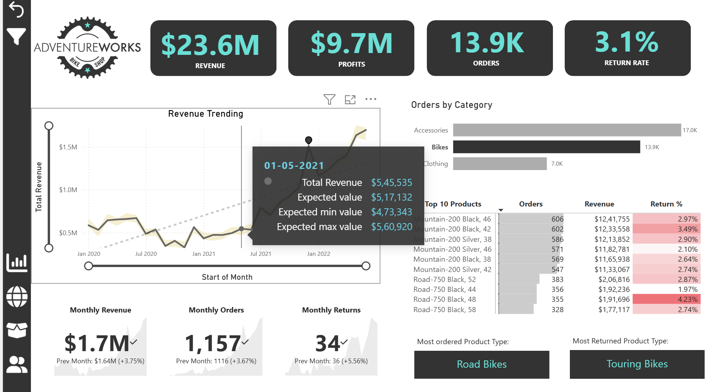
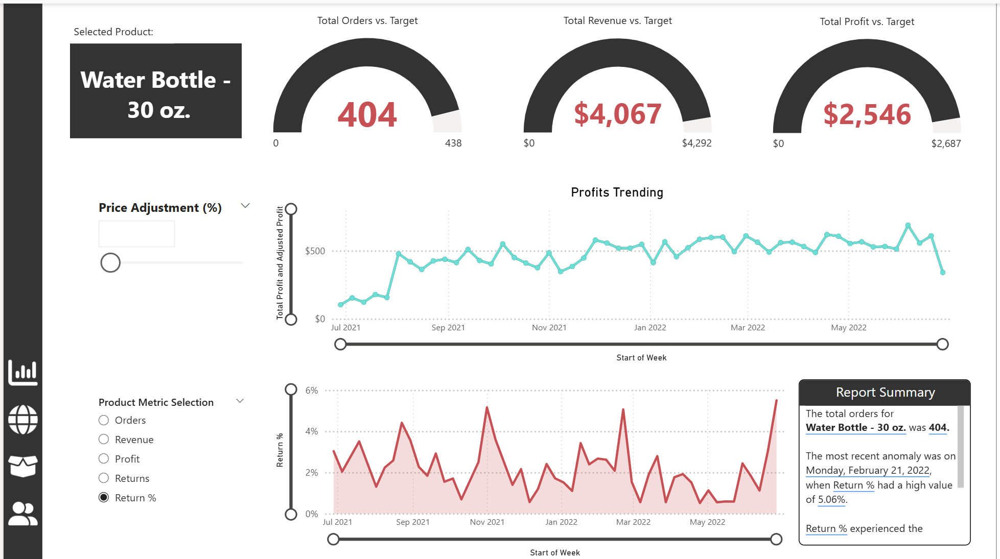
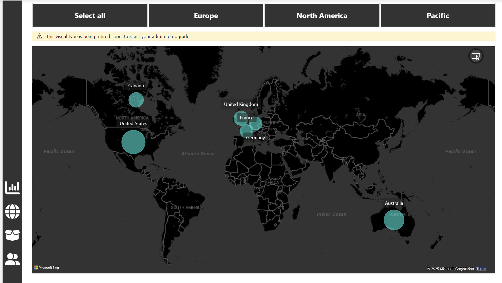

# Adventure Works Sales Analysis Project

## Project Overview
This project aims to analyze and visualize sales performance for Adventure Works using **Power BI** and **Excel**. The analysis combines multiple datasets to provide insights into sales trends, product performance, and quarterly comparisons. The project is designed to assist management in decision-making and to demonstrate practical application of business analytics techniques.

---

## Tools & Technologies
- **Power BI**: For dynamic dashboards, data cleaning (Power Query), AI visuals, and advanced DAX calculations.  
- **Excel**: For quarterly summary reporting and PivotTables to analyze product performance.  
- **M Code**: For creating custom date tables and data transformations in Power BI.  
- **DAX Functions Used**: `CALCULATE`, `FILTER`, `RELATED`, `ALL`, `TOPN`,`SUMX`, `DATEDIFF`and other time intelligence functions.

---

## Data Sources
The project uses multiple CSV files provided by Adventure Works:

| Dataset | Description |
|---------|-------------|
| `Sales_2020.csv`, `Sales_2021.csv`, `Sales_2022.csv` | Contains transaction-level sales data for three years. |
| `Product_Lookup.csv` | Product details and attributes. |
| `Product_Category_Lookup.csv` | Mapping of products to their categories. |
| `Product_Subcategory_Lookup.csv` | Mapping of products to subcategories. |
| `Customer_Lookup.csv` | Customer demographic information. |
| `Territory_Lookup.csv` | Geographical Information. |
| `Returns.csv` | Records of returned products. |

Additionally, a **Date Table** was created in Power BI using M code to enable time-based analysis.

---

## Power BI Analysis

### Data Cleaning
- Imported multiple CSV files into Power BI.
- Used **Power Query** to:
  - Merge datasets.
  - Handle missing and inconsistent data.
  - Create calculated columns for enhanced analysis.

### Dashboards
Created **4 dynamic dashboards**:
1. **Sales Overview Dashboard** – Tracks total sales, trends over time, and monthly comparisons.
2. **Product Performance Dashboard** – Analyzes sales performance by product, subcategory, and category.
3. **Customer Insights Dashboard** – Provides insights into customer behavior and sales distribution.
4. **Maps Dashobard** – emphasizes geospatial insights.

### Advanced Features
- **AI visuals** for predictive insights.  
- **DAX calculations**:
  - `CALCULATE` – For custom aggregations.  
  - `FILTER` – To focus analysis on specific criteria.  
  - `RELATED` – To connect tables and fetch related data.  
  - `DATEDIFF` – To calculate time differences between sales events.  
  - **Advanced KPIs** – Created metrics like Year-to-Date (YTD) sales, Month-to-Date (MTD) sales, rolling averages, and growth percentages.  
  - **Other Time Intelligence Functions** – `SAMEPERIODLASTYEAR`, `TOTALYTD`, `DATEADD`, `PARALLELPERIOD` for comparing periods and analyzing trends over time.

---
## Power BI Dashboards

### Dashboard Visuals

<!-- Overview on top -->

<!-- Customer and Product side by side -->
<table>
<tr>
<td></td>
<td></td>
</tr>
</table>

<!-- Map at the bottom -->

---
## Excel Analysis – Quarter One Report

### Case Study Context
Jamie, an Adventure Works manager, needed to prepare a **Quarter One Report** comparing Q1 sales for 2022 and 2023. Management wanted insights into product-level performance for discussion in the upcoming meeting.

### Steps Taken
1. **Summary Worksheet**
   - Calculated total sales for Q1 2022 and 2023 using Excel formulas.
   - Computed percentage increase in sales for 2023.
   - Broke down sales by month for both years using formulas.

2. **PivotTable Worksheet**
   - Created a PivotTable to analyze performance at product and category levels.
   - Enabled management to quickly identify top-performing products and categories.

---

## Key Insights
- Sales trends over 3 years showed clear seasonal patterns.  
- Certain product categories consistently outperformed others.  
- Returns were concentrated in a few specific product lines.  
- Q1 2023 showed a **% increase in sales** compared to Q1 2022, indicating positive growth.  
- Dashboards allowed management to explore data interactively, while Excel provided concise, actionable summaries for meetings.

---

## Future Work
- Integrate additional data sources such as marketing campaigns or regional sales for more holistic analysis.  
- Implement predictive models using AI visuals in Power BI for sales forecasting.  
- Automate quarterly reports in Excel using Power Query and VBA.  
- Enhance dashboards with drill-through features to allow deeper insights at the product or customer level.

---
